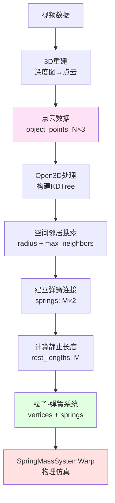
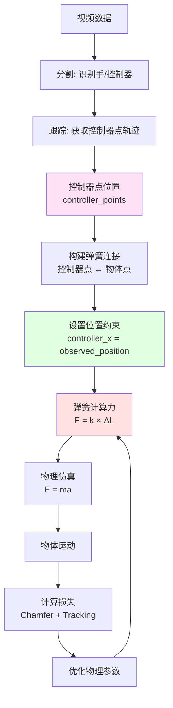

# 弹簧-质量系统优化参数的物理原理解释

本文档从物理原理角度详细解释 `spring_mass_warp.py` 中优化的所有参数。

---

## 1. 弹簧杨氏模量 (spring_Y)

### 物理定义
**杨氏模量（Young's Modulus）** 是材料在弹性变形范围内，应力与应变的比值，表征材料的**刚度**（stiffness）。

### 代码实现
```python
# 第123-127行：弹簧力计算
spring_force = (
    wp.clamp(wp.exp(spring_Y[tid]), low=spring_Y_min, high=spring_Y_max)
    * (dis_len / rest - 1.0)  # 应变 = (当前长度 - 静止长度) / 静止长度
    * d  # 方向向量
)
```

### 物理公式
根据胡克定律（Hooke's Law）：
```
F_spring = k × ΔL
```
其中：
- `k = exp(spring_Y)`：弹簧刚度系数（在代码中使用对数空间存储，便于优化）
- `ΔL = dis_len - rest`：弹簧的伸长量
- `F_spring`：弹簧恢复力

### 物理意义
- **高 spring_Y**：材料**刚硬**，如金属、硬塑料
  - 变形小，恢复快
  - 适合模拟：硬质物体、刚性结构
- **低 spring_Y**：材料**柔软**，如布料、橡胶
  - 变形大，恢复慢
  - 适合模拟：软体物体、可变形材料

### 优化范围
- 代码中：`spring_Y_min = 1e3`，`spring_Y_max = 1e5`
- 实际刚度：`k ∈ [1000, 100000]` N/m
- **为什么用对数空间？**
  - 优化更稳定（避免数值爆炸）
  - 参数分布更均匀
  - 梯度更平滑

---

## 2. 减震器阻尼 (dashpot_damping)

### 物理定义
**减震器（Dashpot）** 是一种提供**粘性阻尼**的机械元件，模拟材料的**内摩擦**和**能量耗散**。

### 代码实现
```python
# 第129-130行：减震器力计算
v_rel = wp.dot(v2 - v1, d)  # 相对速度在弹簧方向上的分量
dashpot_forces = dashpot_damping * v_rel * d
```

### 物理公式
粘性阻尼力（Viscous Damping Force）：
```
F_dashpot = c × v_rel
```
其中：
- `c = dashpot_damping`：阻尼系数（N·s/m）
- `v_rel`：相对速度
- `F_dashpot`：与速度方向相反的阻尼力

### 物理意义
- **高 dashpot_damping**：强阻尼
  - 快速衰减振动
  - 能量耗散快
  - 适合模拟：高粘性材料（如蜂蜜、粘稠液体）
- **低 dashpot_damping**：弱阻尼
  - 振动持续更久
  - 能量耗散慢
  - 适合模拟：低粘性材料（如弹性球、弹簧）

### 作用机制
1. **能量耗散**：将动能转化为热能
2. **振动抑制**：减少系统的振荡
3. **稳定性**：防止系统过度振荡

### 典型值范围
- 轻阻尼：`0.1 - 1.0` N·s/m
- 中阻尼：`1.0 - 10.0` N·s/m
- 重阻尼：`10.0 - 100.0` N·s/m

---

## 3. 拖拽阻尼 (drag_damping)

### 物理定义
**拖拽阻尼（Drag Damping）** 模拟物体在介质（如空气、水）中运动时受到的**阻力**，与速度成正比。

### 代码实现
```python
# 第156-160行：速度更新（包含拖拽阻尼）
drag_damping_factor = wp.exp(-dt * drag_damping)  # 指数衰减因子
all_force = f0 + m0 * wp.vec3(0.0, 0.0, -9.8) * reverse_factor  # 总力 = 弹簧力 + 重力
a = all_force / m0  # 加速度
v1 = v0 + a * dt  # 速度更新
v2 = v1 * drag_damping_factor  # 应用拖拽阻尼
```

### 物理公式
指数衰减模型：
```
v(t) = v₀ × exp(-γt)
```
其中：
- `γ = drag_damping`：衰减率（1/s）
- `v₀`：初始速度
- `v(t)`：t时刻的速度

### 物理意义
- **高 drag_damping**：强空气阻力
  - 快速减速
  - 适合模拟：在粘稠介质中运动（如水下、高密度空气）
- **低 drag_damping**：弱空气阻力
  - 保持速度更久
  - 适合模拟：在稀薄介质中运动（如真空、低密度空气）

### 与 dashpot_damping 的区别
| 参数 | 作用对象 | 物理机制 | 数学形式 |
|------|----------|----------|----------|
| **dashpot_damping** | 弹簧连接 | 相对速度阻尼 | `F = c × v_rel` |
| **drag_damping** | 单个粒子 | 绝对速度衰减 | `v = v₀ × exp(-γt)` |

---

## 4. 地面碰撞弹性系数 (collide_elas)

### 物理定义
**弹性恢复系数（Coefficient of Restitution）** 描述碰撞后物体**反弹**的程度，范围 `[0, 1]`。

### 代码实现
```python
# 第332行：地面碰撞后的法向速度
v_normal_new = -clamp_collide_elas * v_normal
```

### 物理公式
弹性碰撞：
```
v_after = -e × v_before
```
其中：
- `e = collide_elas`：弹性恢复系数
  - `e = 1`：完全弹性碰撞（无能量损失）
  - `e = 0`：完全非弹性碰撞（完全吸收）
  - `0 < e < 1`：部分弹性碰撞（有能量损失）

### 物理意义
- **collide_elas = 1.0**：完全弹性
  - 球会完全反弹
  - 无能量损失
  - 适合模拟：超级球、弹性球
- **collide_elas = 0.0**：完全非弹性
  - 物体粘在地面
  - 完全能量损失
  - 适合模拟：湿泥、粘性材料
- **collide_elas = 0.5 - 0.8**：部分弹性
  - 部分反弹
  - 有能量损失
  - 适合模拟：大多数真实材料

### 能量损失
碰撞前后的动能比：
```
E_after / E_before = e²
```
例如：`e = 0.7` 时，碰撞后保留 `49%` 的动能。

---

## 5. 地面碰撞摩擦系数 (collide_fric)

### 物理定义
**摩擦系数（Friction Coefficient）** 描述物体与地面接触时的**滑动阻力**，影响切向速度。

### 代码实现
```python
# 第333-341行：摩擦处理
a = wp.max(
    0.0,
    1.0
    - clamp_collide_fric
    * (1.0 + clamp_collide_elas)
    * v_normal_length
    / v_tao_length,
)
v_tao_new = a * v_tao  # 切向速度衰减
```

### 物理公式
库仑摩擦模型（Coulomb Friction）：
```
F_friction = μ × F_normal
```
其中：
- `μ = collide_fric`：摩擦系数
- `F_normal`：法向力
- `F_friction`：摩擦力（与速度方向相反）

### 物理意义
- **collide_fric = 0.0**：无摩擦
  - 物体在地面滑动无阻力
  - 适合模拟：冰面、光滑表面
- **collide_fric = 1.0 - 2.0**：高摩擦
  - 强烈减速
  - 适合模拟：粗糙表面、橡胶
- **collide_fric > 1.0**：超高摩擦
  - 可能完全停止滑动
  - 适合模拟：粘性表面

### 摩擦模型
代码使用**速度相关的摩擦模型**：
- 法向速度越大，摩擦力越大
- 切向速度被衰减：`v_tangential = a × v_tangential`
- `a` 取决于摩擦系数和碰撞强度

---

## 6. 物体间碰撞弹性系数 (collide_object_elas)

### 物理定义
与 `collide_elas` 类似，但用于**物体之间的碰撞**（而非物体与地面）。

### 代码实现
```python
# 第205-207行：物体间碰撞的冲量计算
impulse_n = (-(1.0 + clamp_collide_object_elas) * v_rel_n) / (
    1.0 / m1 + 1.0 / m2
)
```

### 物理公式
碰撞冲量（Impulse）：
```
J = -(1 + e) × m_eff × v_rel_n
```
其中：
- `e = collide_object_elas`：弹性恢复系数
- `m_eff = 1/(1/m1 + 1/m2)`：有效质量
- `v_rel_n`：相对法向速度

### 物理意义
- **collide_object_elas = 1.0**：完全弹性碰撞
  - 物体间完全反弹
  - 适合模拟：弹性球碰撞
- **collide_object_elas = 0.0**：完全非弹性碰撞
  - 物体粘在一起
  - 适合模拟：粘性材料碰撞
- **collide_object_elas = 0.3 - 0.7**：部分弹性
  - 真实材料的典型值

### 应用场景
- 自碰撞检测（self-collision）
- 多物体交互
- 物体内部碰撞

---

## 7. 物体间碰撞摩擦系数 (collide_object_fric)

### 物理定义
与 `collide_fric` 类似，但用于**物体之间的滑动摩擦**。

### 代码实现
```python
# 第210-220行：切向冲量计算（考虑摩擦）
v_rel_t = relative_v - v_rel_n  # 切向相对速度
a = wp.max(
    0.0,
    1.0
    - clamp_collide_object_fric
    * (1.0 + clamp_collide_object_elas)
    * v_rel_n_length
    / v_rel_t_length,
)
impulse_t = (a - 1.0) * v_rel_t / (1.0 / m1 + 1.0 / m2)
```

### 物理意义
- **collide_object_fric = 0.0**：无摩擦
  - 物体间滑动无阻力
- **collide_object_fric = 0.3 - 1.0**：中等摩擦
  - 真实材料的典型值
- **collide_object_fric > 1.0**：高摩擦
  - 强烈减速

### 应用场景
- 布料自折叠时的摩擦
- 物体堆叠时的滑动
- 接触表面的能量耗散

---

## 7.5. 碰撞类型说明

### 碰撞检测机制

代码中的碰撞检测基于 **mask** 机制，通过比较粒子的 `mask` 值来判断是否发生碰撞：

```python
# 第196-197行：碰撞检测条件
if (
    mask1 != mask2  # 只有不同mask的粒子才会碰撞
    and dis_len < collision_dist
    and wp.dot(dis, relative_v) < -1e-4
):
```

### 碰撞类型总结表

| 场景 | mask设置 | 碰撞类型 | 使用参数 | 说明 |
|------|---------|----------|----------|------|
| **多物体场景** | 每个物体一个mask值 | 物体之间碰撞 | `collide_object_elas`, `collide_object_fric` | 不同物体（不同mask）的粒子之间发生碰撞 |
| **自碰撞场景** | 每个粒子唯一mask | 内部粒子之间碰撞 | `collide_object_elas`, `collide_object_fric` | 同一物体内部的粒子之间也会碰撞（如布料折叠） |
| **单物体无自碰撞** | 所有粒子相同mask | 无碰撞检测 | 不启用碰撞 | 只通过弹簧力维持形状，无碰撞响应 |
| **地面碰撞** | 所有粒子 | 与地面（z=0）碰撞 | `collide_elas`, `collide_fric` | 所有粒子都可能与地面发生碰撞 |

### 碰撞参数使用说明

1. **`collide_elas` 和 `collide_fric`**：
   - 专门用于**地面碰撞**
   - 当粒子的 z 坐标 < 0 时触发
   - 控制物体与地面的反弹和摩擦

2. **`collide_object_elas` 和 `collide_object_fric`**：
   - 用于**不同mask粒子之间的碰撞**
   - 可以是：
     - 不同物体之间的碰撞（多物体场景）
     - 同一物体内部的碰撞（自碰撞场景）
   - 通过 `mask1 != mask2` 条件判断

### 碰撞检测初始化

```python
# 第641-653行：碰撞检测初始化逻辑
if init_masks is not None:
    if torch.unique(init_masks).shape[0] > 1:  # 多个不同的mask值
        self.object_collision_flag = 1  # 启用碰撞检测

if self_collision:
    # 自碰撞：给每个粒子分配唯一mask
    init_masks = torch.arange(self.n_vertices, ...)
    self.object_collision_flag = 1
```

### 关键区别

- **地面碰撞**：所有粒子都可能发生，使用 `collide_elas` 和 `collide_fric`
- **物体间碰撞**：只有不同mask的粒子之间发生，使用 `collide_object_elas` 和 `collide_object_fric`
- **自碰撞**：通过给每个粒子分配唯一mask实现，同样使用 `collide_object_elas` 和 `collide_object_fric`

---

## 8. 参数优化策略总结

### 参数分类

| 类别 | 参数 | 优化阶段 | 物理意义 |
|------|------|----------|----------|
| **材料属性** | `spring_Y` | 一阶优化 | 材料刚度 |
| **能量耗散** | `dashpot_damping` | 零阶优化 | 内摩擦 |
| | `drag_damping` | 零阶优化 | 介质阻力 |
| **碰撞响应** | `collide_elas` | 零阶优化 | 地面反弹 |
| | `collide_fric` | 零阶优化 | 地面摩擦 |
| | `collide_object_elas` | 零阶优化 | 物体反弹 |
| | `collide_object_fric` | 零阶优化 | 物体摩擦 |

### 优化顺序

1. **零阶优化（CMA-ES）**：
   - 优化全局参数（12个）
   - 包括所有碰撞和阻尼参数
   - 快速找到合理范围

2. **一阶优化（梯度下降）**：
   - 优化密集参数（每个弹簧的 `spring_Y`）
   - 精细调整材料属性
   - 获得更好的拟合

### 物理约束

代码中的物理约束：
```python
# 弹性系数范围：[0, 1]
clamp_collide_elas = wp.clamp(collide_elas[0], low=0.0, high=1.0)

# 摩擦系数范围：[0, 2]
clamp_collide_fric = wp.clamp(collide_fric[0], low=0.0, high=2.0)

# 弹簧刚度范围：[1e3, 1e5]
spring_Y_min = 1e3
spring_Y_max = 1e5
```

---

## 9. 物理模型总结

### 完整的力系统

物体受到的**总力**包括：

```
F_total = F_spring + F_dashpot + F_gravity + F_collision + F_friction
```

其中：
1. **F_spring**：弹簧恢复力（胡克定律）
2. **F_dashpot**：减震器阻尼力（粘性阻尼）
3. **F_gravity**：重力（`mg`）
4. **F_collision**：碰撞力（冲量模型）
5. **F_friction**：摩擦力（库仑摩擦）

### 运动方程

根据牛顿第二定律：
```
F = ma
```

速度更新：
```
v_new = v_old + (F_total / m) × dt
```

位置更新：
```
x_new = x_old + v_new × dt
```

### 能量守恒

- **弹性势能**：`E_potential = ½k(ΔL)²`
- **动能**：`E_kinetic = ½mv²`
- **能量耗散**：通过阻尼和摩擦损失

---

## 10. 实际应用示例

### 布料模拟
- `spring_Y`：中等（模拟布的弹性）
- `dashpot_damping`：低（保持柔软）
- `collide_object_elas`：低（避免过度反弹）
- `collide_object_fric`：中等（模拟布之间的摩擦）

### 橡胶球
- `spring_Y`：高（弹性好）
- `dashpot_damping`：低（保持弹性）
- `collide_elas`：高（`0.8-0.9`，强反弹）
- `collide_fric`：中等（滚动摩擦）

### 软体动物（如sloth）
- `spring_Y`：低（柔软）
- `dashpot_damping`：中等（适度阻尼）
- `collide_object_elas`：低（`0.3-0.5`，弱反弹）
- `collide_object_fric`：高（防止滑动）

---

## 11. 代码实现细节

### 对数空间优化
```python
# 第742-746行：spring_Y 使用对数空间
self.wp_spring_Y = wp.from_torch(
    torch.log(torch.tensor(spring_Y, ...))  # 对数变换
    * torch.ones(self.n_springs, ...),
    requires_grad=True,
)

# 第124行：使用时取指数
wp.clamp(wp.exp(spring_Y[tid]), low=spring_Y_min, high=spring_Y_max)
```

**优势**：
- 数值稳定性
- 优化更平滑
- 参数分布更均匀

### 碰撞检测优化
```python
# 第246行：使用空间哈希加速
neighbors = wp.hash_grid_query(grid, x1, collision_dist * 5.0)
```

**优势**：
- O(1) 平均查找时间
- 支持大规模粒子系统
- GPU并行友好

---

## 12. 输入数据：从点云到粒子系统

### 问题：输入是什么类型的数据？

`SpringMassSystemWarp` 的输入 `init_vertices` 本质上是**点云数据**，但经过了处理转换为粒子-弹簧系统。

### 数据转换流程

| 阶段 | 数据类型 | 数据格式 | 说明 |
|------|----------|----------|------|
| **原始输入** | 点云（Point Cloud） | `object_points`: `[N, 3]` | 3D坐标点集，从视频重建得到 |
| **处理过程** | Open3D PointCloud | `o3d.geometry.PointCloud` | 使用KDTree进行空间邻居搜索 |
| **中间结果** | 粒子+弹簧连接 | `vertices`: `[N, 3]`<br/>`springs`: `[M, 2]`<br/>`rest_lengths`: `[M]` | 点云中的点成为粒子，点之间建立弹簧连接 |
| **最终输入** | `init_vertices` | `torch.Tensor([N, 3])` | 传递给 `SpringMassSystemWarp` |

### 代码实现

```python
# qqtt/engine/trainer_warp.py 第194-260行
def _init_start(self, object_points, controller_points, ...):
    # 1. 点云输入
    object_points = object_points.cpu().numpy()  # [N, 3] 点云坐标
    
    # 2. 使用 Open3D 处理点云
    object_pcd = o3d.geometry.PointCloud()
    object_pcd.points = o3d.utility.Vector3dVector(object_points)
    pcd_tree = o3d.geometry.KDTreeFlann(object_pcd)  # 构建KD树
    
    # 3. 点云中的点直接成为粒子
    points = np.asarray(object_pcd.points)  # [N, 3]
    
    # 4. 通过空间邻域搜索建立弹簧连接
    for i in range(len(points)):
        # 在半径 object_radius 内找最多 object_max_neighbours 个邻居
        [k, idx, _] = pcd_tree.search_hybrid_vector_3d(
            points[i], object_radius, object_max_neighbours
        )
        for j in idx:
            # 创建弹簧连接点 i 和点 j
            springs.append([i, j])
            rest_lengths.append(np.linalg.norm(points[i] - points[j]))
    
    # 5. 返回给 SpringMassSystemWarp
    return (
        torch.tensor(points, ...),        # init_vertices: [N, 3]
        torch.tensor(springs, ...),      # init_springs: [M, 2]
        torch.tensor(rest_lengths, ...),  # init_rest_lengths: [M]
        torch.tensor(masses, ...),        # init_masses: [N]
        num_object_springs,
    )
```

### 关键要点

1. **点云 → 粒子**：
   - 点云中的每个3D点成为一个粒子（vertex）
   - 粒子具有位置、速度、质量等物理属性

2. **空间邻域 → 弹簧连接**：
   - 使用KDTree在空间邻域内搜索邻居点
   - 在邻居点之间建立弹簧连接
   - 弹簧的静止长度 = 初始时两点之间的距离

3. **参数控制**：
   - `object_radius`：物体点之间的连接半径
   - `object_max_neighbours`：每个点最多连接的邻居数
   - `controller_radius`：控制器点与物体点的连接半径
   - `controller_max_neighbours`：每个控制器点最多连接的物体点数

### 完整数据流



### 总结

- **输入是点云**：`SpringMassSystemWarp` 的 `init_vertices` 参数来自点云数据
- **处理过程**：点云通过空间邻域搜索转换为粒子-弹簧系统
- **每个点成为一个粒子**：点云中的3D坐标点直接成为物理仿真中的粒子
- **弹簧连接**：通过KDTree在空间邻域内建立弹簧连接，形成物理结构

这种设计使得 PhysTwin 能够直接从3D重建的点云数据构建物理仿真系统，无需额外的网格化或体素化步骤。

---

## 13. 力的近似：从观测数据到物理仿真

### 问题：数据中没有力信息

在物理系统中求解需要知道**力**，但视频数据中**没有直接测量力**。PhysTwin 使用了一个巧妙的方法：**位置驱动（Position-Driven）**而非**力驱动（Force-Driven）**。

### 核心思想：控制器点（Controller Points）

PhysTwin 通过以下步骤从视频数据中推断外力：

#### 1. 控制器点提取

从视频中跟踪**手/控制器**的位置：

```python
# data_process/data_process_track.py
# 1. 使用分割（GroundedSAM2）识别手/控制器
controller_mask = segment_hand_from_video()

# 2. 使用密集跟踪（Co-tracker）跟踪控制器点
controller_points = track_points(controller_mask)

# 3. 过滤和采样，得到最终的控制器点（约30个）
controller_points = farthest_point_sampling(controller_points, n=30)
```

**关键**：控制器点代表**外力作用的位置**，而不是力的大小。

#### 2. 弹簧连接机制

控制器点通过**弹簧**连接到物体点：

```python
# qqtt/engine/trainer_warp.py 第236-250行
if controller_points is not None:
    # 为每个控制器点找到附近的物体点
    for i in range(len(controller_points)):
        neighbors = find_neighbors(controller_points[i], 
                                   radius=controller_radius,
                                   max_neighbors=controller_max_neighbours)
        # 创建弹簧连接
        for j in neighbors:
            springs.append([controller_point_idx, object_point_idx])
            rest_lengths.append(distance(controller_points[i], object_points[j]))
```

**物理意义**：
- 控制器点 = 手的位置（从视频中观测到）
- 弹簧连接 = 手与物体的接触关系
- 静止长度 = 初始接触时的距离

#### 3. 位置约束产生力

当控制器点移动时，弹簧被拉伸/压缩，**隐式产生力**：

```python
# spring_mass_warp.py 第63-78行：设置控制器点位置
def set_control_points(original_control_point, target_control_point, step):
    # 控制器点从 original 位置移动到 target 位置（线性插值）
    control_x = original + (target - original) * t

# spring_mass_warp.py 第103-137行：计算弹簧力
def eval_springs(x, control_x, springs, rest_lengths, spring_Y):
    # 如果弹簧一端是控制器点
    if idx1 >= num_object_points:
        x1 = control_x[idx1 - num_object_points]  # 使用控制器点位置
    else:
        x1 = x[idx1]  # 使用物体点位置
    
    # 计算弹簧长度
    dis_len = length(x2 - x1)
    
    # 弹簧力 = k * (当前长度 - 静止长度)
    spring_force = spring_Y * (dis_len / rest - 1.0) * direction
    
    # 力作用在物体点上（控制器点位置固定）
    if idx1 < num_object_points:
        force[idx1] += spring_force
```

**力的生成过程**：

```
控制器点移动（观测数据）
    ↓
弹簧被拉伸/压缩
    ↓
产生弹簧恢复力 F = k × (L - L_rest)
    ↓
力作用在物体点上
    ↓
物体产生运动
```

### 数学原理

#### 位置约束模型

控制器点的位置是**约束**（constraint），而非直接施加的力：

```
约束：controller_x(t) = observed_position(t)  # 从视频中观测到
```

当控制器点移动时，连接的弹簧产生力：

```
F_spring = k × (controller_x - object_x - L_rest) × direction
```

#### 力的隐式计算

**不需要显式计算力**，只需要：
1. **观测控制器位置**：`controller_points[t]`（从视频跟踪得到）
2. **设置位置约束**：在仿真中固定控制器点位置
3. **弹簧自动产生力**：通过胡克定律计算

### 优势

1. **无需力传感器**：只需要位置信息（可以从视频中提取）
2. **物理一致性**：力由物理定律（胡克定律）自动产生
3. **可微分**：支持梯度反向传播，便于优化
4. **鲁棒性**：即使控制器点跟踪有误差，弹簧系统也能平滑处理

### 完整流程



### 与直接力驱动的对比

| 方法 | 输入 | 力的来源 | 优势 | 劣势 |
|------|------|----------|------|------|
| **力驱动** | 力的大小和方向 | 直接指定 | 精确控制 | 需要力传感器，难以从视频获取 |
| **位置驱动**<br/>（PhysTwin） | 控制器点位置 | 弹簧隐式产生 | 可从视频提取，物理一致 | 力的大小取决于弹簧参数 |

### 力的可视化

训练完成后，可以**反向计算**施加的力：

```python
# qqtt/engine/trainer_warp.py 第1453行
def visualize_force():
    # 1. 找到连接控制器点的弹簧
    force_springs = find_springs_connected_to_controller()
    
    # 2. 计算弹簧力
    for spring in force_springs:
        force = spring_Y * (current_length - rest_length)
    
    # 3. 可视化力向量
    visualize_force_vectors(forces)
```

这允许在训练后**分析**手施加的力，即使训练时没有直接使用力信息。

---

## 总结

PhysTwin 的弹簧-质量系统通过优化7个核心物理参数，实现了对真实材料行为的精确建模：

1. **材料刚度**（spring_Y）：控制变形能力
2. **内摩擦**（dashpot_damping）：控制能量耗散
3. **介质阻力**（drag_damping）：控制速度衰减
4. **碰撞弹性**（collide_elas, collide_object_elas）：控制反弹程度
5. **摩擦**（collide_fric, collide_object_fric）：控制滑动阻力

**关键创新**：通过**位置驱动**而非力驱动，PhysTwin 能够从视频观测数据中隐式推断外力，无需力传感器。控制器点通过弹簧连接到物体，当控制器点移动时，弹簧自动产生力，实现了从观测到物理仿真的完整闭环。

这些参数的组合能够模拟从刚硬金属到柔软布料的广泛材料特性，为物理感知的3D重建提供了坚实的基础。

