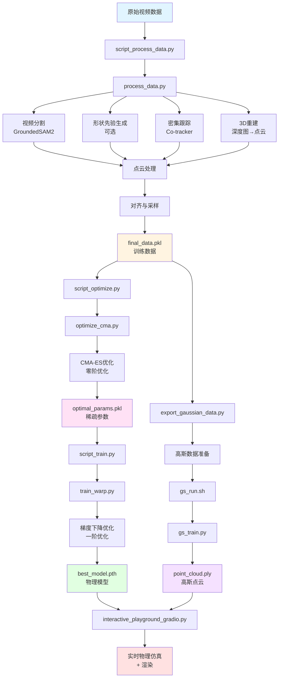
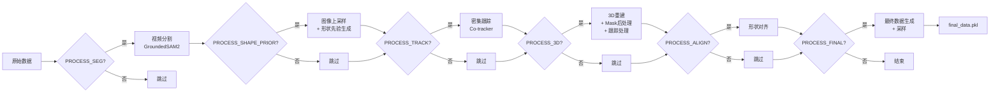
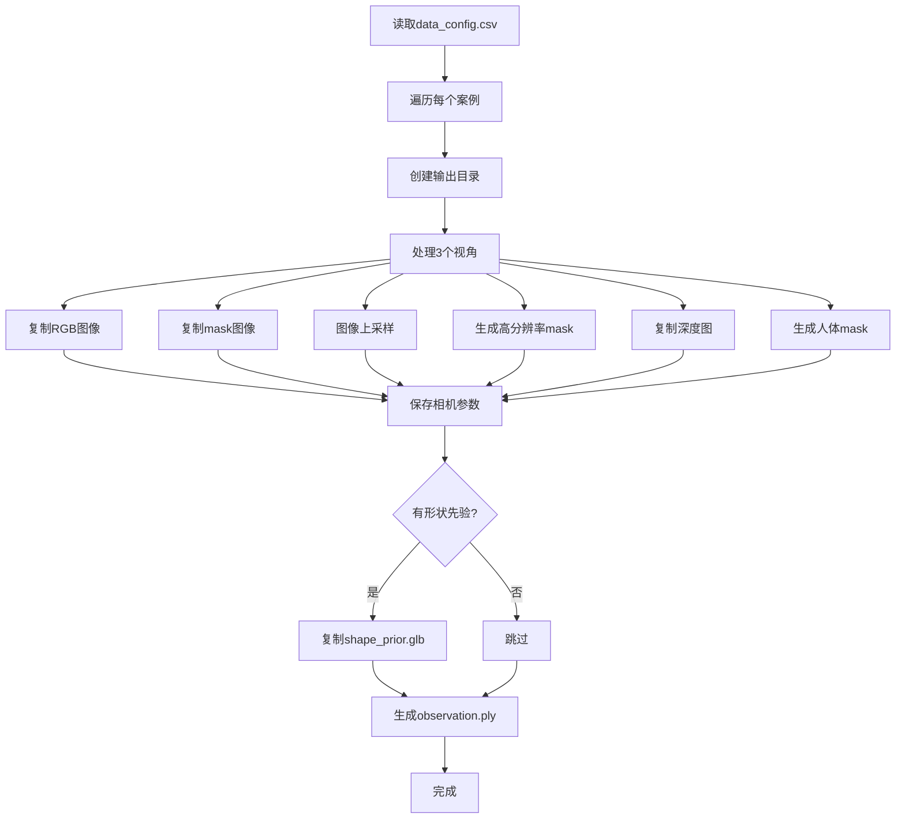
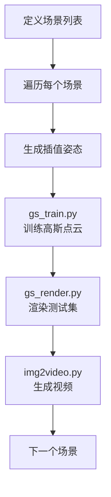
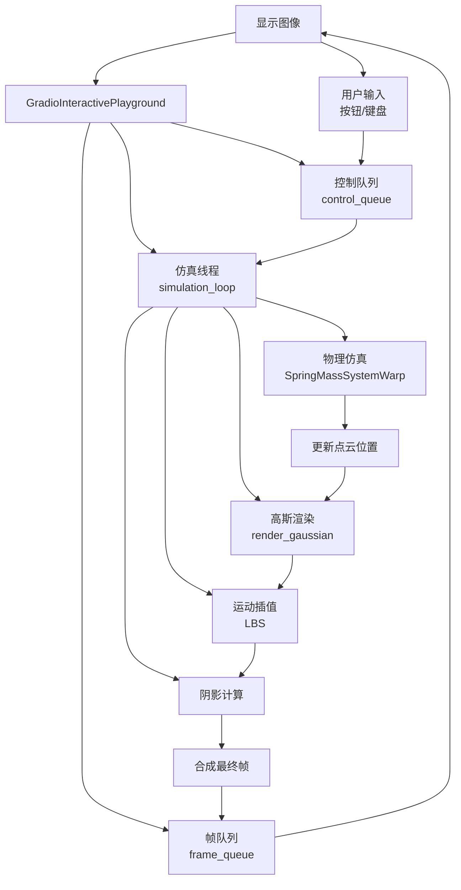
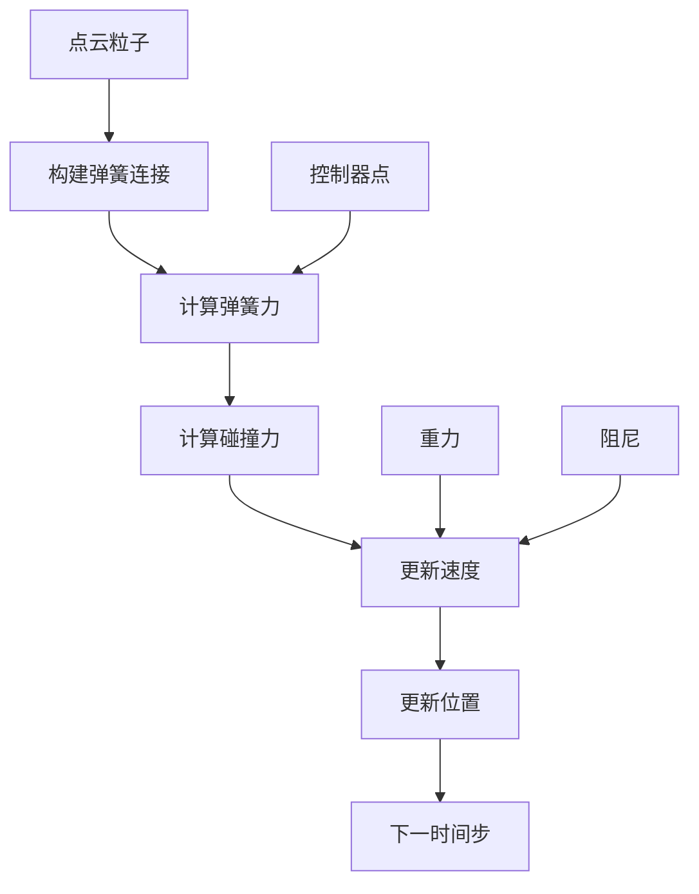
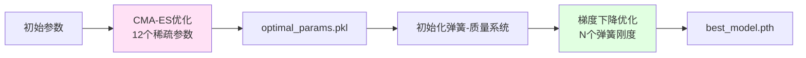
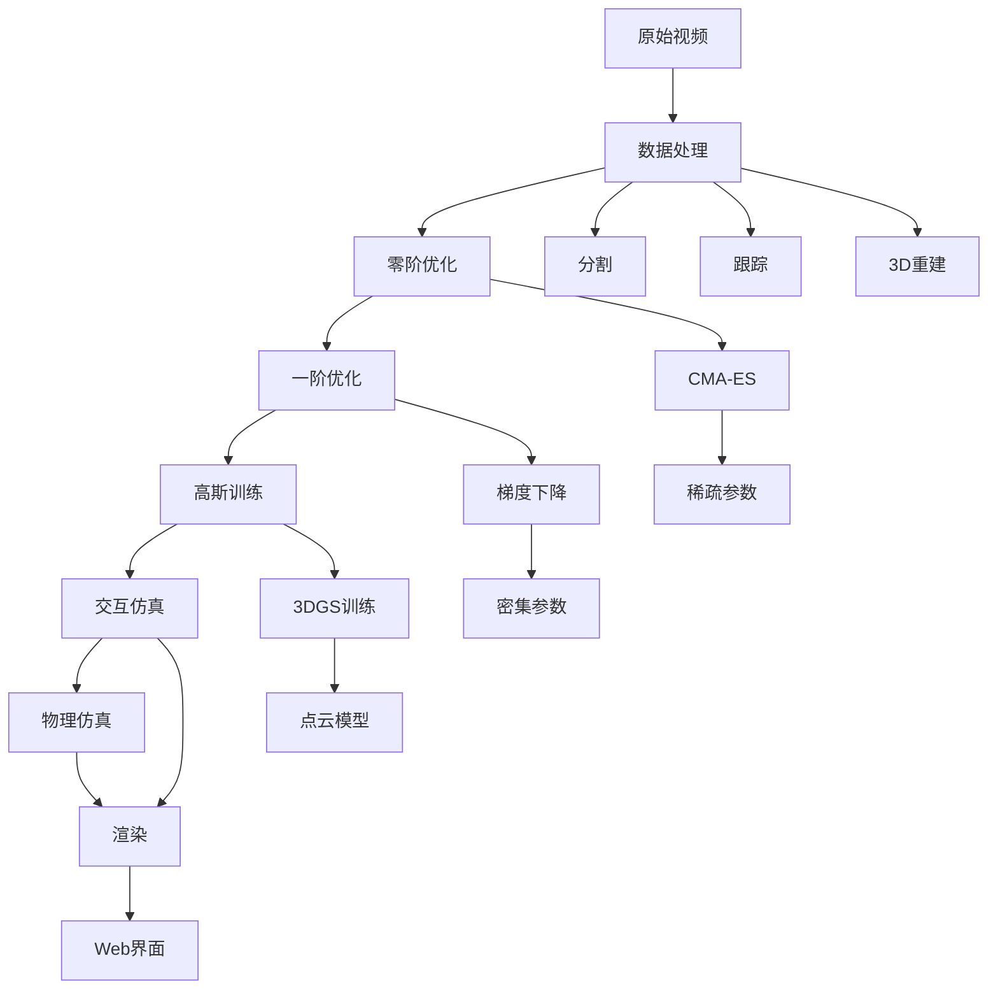

# PhysTwin 项目架构分析文档

## 1. 项目概述

PhysTwin 是一个从视频中重建和模拟可变形物体的物理感知框架。它能够从多视角视频中学习物体的物理属性（如弹性、摩擦系数等），并构建可交互的物理仿真模型。

### 核心特性
- **物理感知重建**：从视频中推断物体的物理参数
- **实时交互仿真**：支持键盘/Web界面控制
- **两阶段优化**：零阶优化（CMA-ES）+ 一阶优化（梯度下降）
- **高斯点云渲染**：高质量的外观建模

---

## 2. 项目架构

### 2.1 整体流程

项目采用**数据驱动**的物理参数学习流程，主要包含以下阶段：

1. **数据预处理**：从原始视频提取3D点云、跟踪、分割等
2. **零阶优化**：使用CMA-ES优化稀疏物理参数
3. **一阶优化**：使用梯度下降优化弹簧刚度等密集参数
4. **外观建模**：训练高斯点云模型
5. **交互式仿真**：实时物理仿真和渲染

### 2.2 核心模块

```
PhysTwin/
├── data_process/          # 数据处理模块
│   ├── segment.py         # 视频分割
│   ├── dense_track.py    # 密集跟踪
│   ├── data_process_pcd.py  # 3D点云处理
│   └── ...
├── qqtt/                  # 物理仿真核心
│   ├── engine/
│   │   ├── trainer_warp.py      # 训练器（一阶优化）
│   │   └── cma_optimize_warp.py # CMA优化器（零阶优化）
│   └── model/
│       └── diff_simulator/
│           └── spring_mass_warp.py  # 弹簧-质量系统
├── gaussian_splatting/    # 高斯点云渲染
└── scripts/              # 批处理脚本
```

---

## 3. 数据流分析

### 3.1 完整数据流图



### 3.2 各阶段数据格式

| 阶段 | 输入 | 输出 | 数据格式 |
|------|------|------|----------|
| 数据处理 | RGB视频、深度图、相机参数 | `final_data.pkl` | 点云、跟踪、mask |
| 零阶优化 | `final_data.pkl` | `optimal_params.pkl` | 物理参数（弹簧刚度、碰撞参数等） |
| 一阶优化 | `final_data.pkl` + `optimal_params.pkl` | `best_model.pth` | 优化的弹簧-质量系统 |
| 高斯训练 | RGB图像、mask、深度 | `point_cloud.ply` | 高斯点云模型 |
| 交互仿真 | `best_model.pth` + `point_cloud.ply` | 实时渲染帧 | RGB图像（numpy array） |

---

## 4. 核心脚本分析

### 4.1 script_process_data.py

**功能**：批量处理多个案例的原始数据

**运行逻辑**：
```python
for each case in data_config.csv:
    if shape_prior == "true":
        process_data.py --shape_prior
    else:
        process_data.py
```

**关键步骤**：
1. 读取 `data_config.csv` 获取案例列表
2. 对每个案例调用 `process_data.py`
3. 根据配置决定是否使用形状先验

**输出**：
- `{case_name}/final_data.pkl`：处理后的训练数据
- `{case_name}/split.json`：训练/测试集划分

---

### 4.2 process_data.py

**功能**：处理单个案例的原始视频数据，生成训练所需的数据

**运行逻辑**：



**核心步骤详解**：

1. **视频分割（PROCESS_SEG）**
   - 使用 GroundedSAM2 分割物体和控制器（手）
   - 输出：mask图像和mask_info.json

2. **形状先验生成（PROCESS_SHAPE_PRIOR，可选）**
   - 图像上采样（SDXL）
   - 分割物体mask
   - 使用 Trellis 生成3D mesh
   - 输出：`shape_prior.glb`

3. **密集跟踪（PROCESS_TRACK）**
   - 使用 Co-tracker 进行密集点跟踪
   - 输出：跟踪轨迹数据

4. **3D重建（PROCESS_3D）**
   - 从深度图生成点云（`data_process_pcd.py`）
   - Mask后处理（`data_process_mask.py`）
   - 跟踪数据处理（`data_process_track.py`）

5. **对齐（PROCESS_ALIGN，可选）**
   - 将形状先验与观测点云对齐

6. **最终数据生成（PROCESS_FINAL）**
   - 点云采样和过滤
   - 生成 `final_data.pkl`，包含：
     - `object_points`：物体点云
     - `controller_points`：控制器点云
     - `object_colors`：点云颜色
     - `object_visibilities`：可见性
     - `object_motions_valid`：运动有效性

---

### 4.3 export_gaussian_data.py

**功能**：为高斯点云训练准备数据

**运行逻辑**：



**输出结构**：
```
gaussian_data/{case_name}/
├── 0.png, 1.png, 2.png          # RGB图像
├── mask_0.png, mask_1.png, ...   # 物体mask
├── 0_high.png, ...               # 高分辨率图像
├── mask_0_high.png, ...         # 高分辨率mask
├── 0_depth.npy, ...              # 深度图
├── mask_human_0.png, ...        # 人体mask
├── camera_meta.pkl               # 相机参数
├── observation.ply              # 观测点云
└── shape_prior.glb              # 形状先验（可选）
```

---

### 4.4 script_optimize.py

**功能**：批量运行零阶优化（CMA-ES）

**运行逻辑**：
```python
for each case in data/different_types:
    read split.json → get train_frame
    run optimize_cma.py --train_frame {train_frame}
```

**调用链**：
```
script_optimize.py
  └─> optimize_cma.py
       └─> OptimizerCMA.optimize()
            └─> CMA-ES算法
                 └─> error_func()  # 评估函数
                      └─> SpringMassSystemWarp  # 物理仿真
```

**优化参数**（12个）：
1. `global_spring_Y`：全局弹簧杨氏模量
2. `object_radius`：物体邻域半径
3. `object_max_neighbours`：物体最大邻居数
4. `controller_radius`：控制器邻域半径
5. `controller_max_neighbours`：控制器最大邻居数
6. `collide_elas`：碰撞弹性系数
7. `collide_fric`：碰撞摩擦系数
8. `collide_object_elas`：物体碰撞弹性
9. `collide_object_fric`：物体碰撞摩擦
10. `collision_dist`：碰撞距离阈值
11. `drag_damping`：拖拽阻尼
12. `dashpot_damping`：减震器阻尼

**优化算法**：CMA-ES (Covariance Matrix Adaptation Evolution Strategy)
- 零阶优化（无需梯度）
- 适合优化离散/稀疏参数
- 默认迭代20次

**输出**：
- `experiments_optimization/{case_name}/optimal_params.pkl`

---

### 4.5 script_train.py

**功能**：批量运行一阶优化（梯度下降）

**运行逻辑**：
```python
for each case in data/different_types:
    read split.json → get train_frame
    load optimal_params.pkl  # 从零阶优化加载
    run train_warp.py --train_frame {train_frame}
```

**调用链**：
```
script_train.py
  └─> train_warp.py
       └─> InvPhyTrainerWarp.train()
            └─> 梯度下降优化
                 └─> SpringMassSystemWarp (可微分)
                      └─> 计算损失
                           ├─> Chamfer Loss
                           └─> Tracking Loss
```

**优化目标**：
- **Chamfer Loss**：预测点云与真实点云的Chamfer距离
- **Tracking Loss**：跟踪点的位置误差

**优化参数**：
- 每个弹簧的 `spring_Y`（密集参数，数量=弹簧数）
- 使用 Adam 优化器

**训练过程**：
1. 初始化弹簧-质量系统（使用CMA-ES优化的参数）
2. 对每个训练帧：
   - 设置控制器目标
   - 运行物理仿真（前向传播）
   - 计算损失（Chamfer + Tracking）
   - 反向传播更新参数
3. 保存最佳模型

**输出**：
- `experiments/{case_name}/train/best_*.pth`

---

### 4.6 gs_run.sh

**功能**：批量训练高斯点云模型

**运行逻辑**：



**训练参数**（`gs_train.py`）：
- `iterations`: 10000
- `lambda_depth`: 0.001
- `lambda_normal`: 0.0
- `lambda_anisotropic`: 0.0
- `lambda_seg`: 1.0
- `use_masks`: True
- `isotropic`: True
- `gs_init_opt`: 'hybrid'

**输出**：
- `gaussian_output/{case_name}/{exp_name}/point_cloud/iteration_10000/point_cloud.ply`

---

### 4.7 interactive_playground_gradio.py

**功能**：基于Gradio的Web交互式物理仿真界面

**架构设计**：



**核心组件**：

1. **GradioInteractivePlayground类**
   - `setup_simulation()`：初始化仿真环境
   - `simulation_loop()`：后台仿真循环（独立线程）
   - `get_frame()`：从队列获取最新帧
   - `send_key()` / `release_key()`：处理用户输入

2. **仿真循环**（`simulation_loop`）：
   ```python
   while running:
       # 1. 处理控制命令
       process_control_queue()
       
       # 2. 物理仿真步进
       simulator.step()
       
       # 3. 高斯点云渲染
       render_gaussian()
       
       # 4. 运动插值（LBS）
       interpolate_motions_speedup()
       
       # 5. 阴影计算
       get_simple_shadow()
       
       # 6. 合成最终帧
       compose_frame()
       
       # 7. 放入帧队列
       frame_queue.put(frame)
   ```

3. **控制映射**：
   - **单控制（n_ctrl_parts=1）**：W/S/A/D/Q/E
   - **双控制（n_ctrl_parts=2）**：W/S/A/D/Q/E（左手）+ I/K/J/L/U/O（右手）

4. **渲染流程**：
   - 加载高斯点云模型
   - 根据物理仿真结果更新点云位置（LBS插值）
   - 渲染到图像
   - 叠加背景和阴影
   - 输出RGB图像

**性能优化**：
- 使用队列缓存帧（maxsize=10），避免阻塞
- 帧缓存机制，避免显示空白
- 33ms刷新率（~30 FPS）
- 后台线程运行仿真，不阻塞UI

---

## 5. 核心算法

### 5.1 弹簧-质量系统（Spring-Mass System）

**物理模型**：



**核心公式**：

1. **弹簧力**：
   ```
   F_spring = k * (L - L_rest) * direction
   ```
   其中：
   - `k = exp(spring_Y)`：弹簧刚度（对数空间）
   - `L`：当前长度
   - `L_rest`：静止长度
   - `direction`：弹簧方向向量

2. **减震器力**：
   ```
   F_dashpot = damping * v_rel * direction
   ```
   其中 `v_rel` 是相对速度

3. **速度更新**：
   ```
   v_new = v_old + (F_total / m + g) * dt
   ```
   其中：
   - `F_total = F_spring + F_dashpot + F_collision`
   - `g = [0, 0, -9.8]`：重力加速度
   - `dt`：时间步长

4. **位置更新**：
   ```
   x_new = x_old + v_new * dt
   ```

**实现**：使用 Nvidia Warp 实现可微分的GPU加速仿真

---

### 5.2 两阶段优化策略

**为什么需要两阶段？**

1. **零阶优化（CMA-ES）**：
   - 优化**稀疏参数**（12个全局参数）
   - 无需梯度，适合离散/混合优化
   - 快速找到合理的参数范围

2. **一阶优化（梯度下降）**：
   - 优化**密集参数**（每个弹簧的刚度）
   - 需要可微分仿真器
   - 精细调整，获得更好的拟合

**优化流程**：



---

### 5.3 运动插值（LBS - Linear Blend Skinning）

**目的**：将物理粒子的运动传播到高斯点云

**算法**：

1. **KNN权重计算**：
   ```python
   weights, indices = knn_weights_sparse(
       particle_pos,  # 物理粒子位置
       gaussian_xyz,  # 高斯点位置
       K=16
   )
   ```

2. **运动插值**：
   ```python
   gaussian_motion = sum(weights[i] * particle_motion[indices[i]])
   ```

3. **更新高斯点**：
   ```python
   gaussian_xyz_new = gaussian_xyz + gaussian_motion
   gaussian_rotation_new = interpolate_rotation(...)
   ```

**优势**：
- 平滑的运动传播
- 支持大规模点云
- GPU加速

---

### 5.4 高斯点云渲染

**模型**：3D Gaussian Splatting

**训练目标**：
- **RGB Loss**：L1 + SSIM
- **Depth Loss**：L1（如果提供深度）
- **Segmentation Loss**：交叉熵（如果提供mask）

**渲染流程**：
1. 根据相机参数投影高斯点
2. 按深度排序
3. Alpha混合合成
4. 输出RGB图像

---

## 6. 数据流详细说明

### 6.1 输入数据格式

**原始数据**（`data/different_types/{case_name}/`）：
```
├── color/          # RGB图像（多视角、多帧）
│   ├── 0/0.png, 0/1.png, ...
│   ├── 1/0.png, 1/1.png, ...
│   └── 2/0.png, 2/1.png, ...
├── depth/          # 深度图
│   ├── 0/0.npy, 0/1.npy, ...
│   └── ...
├── calibrate.pkl   # 相机外参（c2w矩阵）
└── metadata.json   # 相机内参、图像尺寸
```

### 6.2 中间数据格式

**处理后的数据**（`final_data.pkl`）：
```python
{
    'object_points': np.array,      # [N, 3] 物体点云
    'controller_points': np.array,   # [M, 3] 控制器点云
    'object_colors': np.array,       # [N, 3] 点云颜色
    'object_visibilities': np.array, # [T, N] 可见性矩阵
    'object_motions_valid': np.array,# [T, N] 运动有效性
    # ... 其他元数据
}
```

**优化参数**（`optimal_params.pkl`）：
```python
{
    'global_spring_Y': float,
    'object_radius': float,
    'object_max_neighbours': int,
    'controller_radius': float,
    'controller_max_neighbours': int,
    'collide_elas': float,
    'collide_fric': float,
    'collide_object_elas': float,
    'collide_object_fric': float,
    'collision_dist': float,
    'drag_damping': float,
    'dashpot_damping': float,
}
```

**训练模型**（`best_model.pth`）：
```python
{
    'spring_Y': torch.Tensor,        # [N_springs] 每个弹簧的刚度
    'collide_elas': torch.Tensor,
    'collide_fric': torch.Tensor,
    'collide_object_elas': torch.Tensor,
    'collide_object_fric': torch.Tensor,
    'num_object_springs': int,
    # ... 其他参数
}
```

### 6.3 输出数据格式

**高斯点云**（`point_cloud.ply`）：
- PLY格式的3D高斯点
- 包含位置、颜色、旋转、缩放、不透明度等属性

**实时渲染**：
- RGB图像：`numpy.ndarray`，shape `[H, W, 3]`，dtype `uint8`
- 通过Gradio界面实时显示

---

## 7. 关键技术点

### 7.1 可微分物理仿真

- **工具**：Nvidia Warp
- **优势**：
  - GPU加速
  - 自动微分
  - 支持大规模粒子系统

### 7.2 碰撞检测

- **方法**：基于空间哈希的邻域搜索
- **处理**：
  - 自碰撞（可选）
  - 物体间碰撞
  - 碰撞响应（弹性+摩擦）

### 7.3 实时渲染优化

- **帧缓存**：队列机制避免帧丢失
- **异步处理**：仿真在后台线程运行
- **LBS加速**：稀疏KNN权重计算

### 7.4 多视角融合

- **点云融合**：多视角深度图→点云
- **跟踪一致性**：跨视角跟踪点匹配
- **可见性处理**：处理遮挡和视角变化

---

## 8. 运行流程总结

### 完整pipeline：



### 典型使用场景：

1. **从头开始构建PhysTwin**：
   ```
   python script_process_data.py
   python export_gaussian_data.py
   python script_optimize.py
   python script_train.py
   bash gs_run.sh
   ```

2. **使用已有模型进行交互**：
   ```
   python interactive_playground_gradio.py \
       --case_name double_stretch_sloth \
       --n_ctrl_parts 2
   ```

---

## 9. 性能指标

- **零阶优化**：~12分钟（取决于迭代次数）
- **一阶优化**：~5分钟（RTX 4090，无可视化）
- **交互仿真**：~37 FPS（RTX 4090，sloth案例）
- **GPU内存**：~2-4GB（交互界面）

---

## 10. 总结

PhysTwin 项目通过以下创新实现了从视频到可交互物理仿真的完整流程：

1. **两阶段优化**：结合零阶和一阶优化，平衡效率和精度
2. **可微分物理**：使用Warp实现高效的梯度计算
3. **外观建模**：3D Gaussian Splatting提供高质量渲染
4. **实时交互**：Web界面支持实时控制和可视化

该框架为可变形物体的物理建模提供了一个完整的解决方案，适用于XR、VR和机器人应用。

