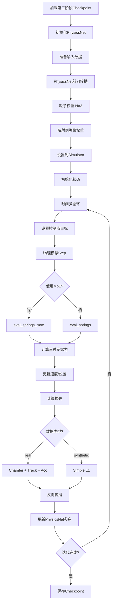
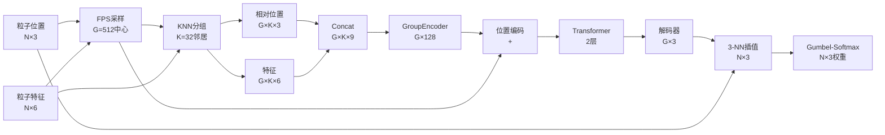
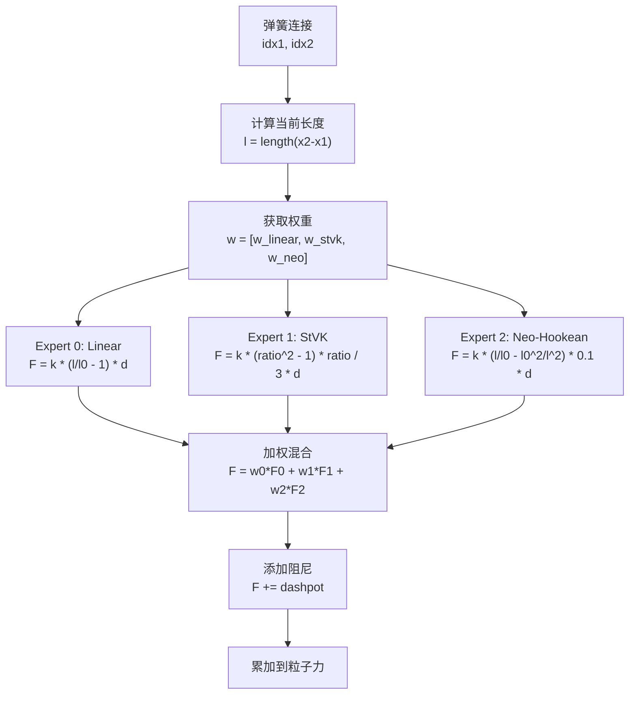

# 第三阶段训练：Neural Constitutive Law (PhysicsNet)

## 📋 概述

第三阶段训练引入了 **Neural Constitutive Law（神经本构律）**，通过 `PhysicsNet` 神经网络学习空间变化的复杂材质属性。与第二阶段（全局均匀材质）不同，第三阶段允许物体不同部位具有不同的物理行为，从而更准确地模拟真实世界的可变形物体。

### 核心思想

- **第二阶段**：假设物体材质均匀，优化全局物理参数（如 `spring_Y`）
- **第三阶段**：使用神经网络根据局部几何特征，为每个粒子预测最适合的本构模型混合权重

### 训练目标

学习一个映射函数：
```
f: (位置, 特征) → (本构模型权重)
```

使得模拟结果与真实观测数据最匹配。

---

## 🏗️ 模型架构

### PhysicsNet 架构

`PhysicsNet` 是一个基于 **PointNet++** 和 **Transformer** 的神经网络，用于预测每个粒子的本构模型权重。

#### 输入
- **位置** `pos`: `(B, N, 3)` - 粒子在初始状态（Lagrangian）的 3D 坐标
- **特征** `features`: `(B, N, C)` - 粒子特征（位置 + RGB 颜色），`C = 6`

#### 网络结构

```
输入: (B, N, 3) + (B, N, 6)
  ↓
1. 分组 (FPS + KNN)
  ├─ FPS: 选择 G=512 个中心点
  └─ KNN: 为每个中心找 K=32 个邻居
  ↓
2. 局部编码 (GroupEncoder)
  ├─ Conv1d(9 → 64) + BN + ReLU
  ├─ Max Pooling (局部特征)
  ├─ Concat(局部, 全局)
  └─ Conv1d(128 → 128) + BN + ReLU
  ↓
3. 位置编码
  └─ MLP(3 → 128) - 基于中心点坐标
  ↓
4. Transformer (2层)
  ├─ Multi-Head Attention (4 heads)
  ├─ Feed-Forward (256 dim)
  └─ LayerNorm (norm_first=True)
  ↓
5. 解码器
  ├─ LayerNorm
  ├─ Linear(128 → 128) + GELU
  └─ Linear(128 → 3)  # 3个专家
  ↓
6. 插值回所有粒子 (3-NN)
  └─ 平均最近3个中心的logits
  ↓
7. Gumbel-Softmax (hard=True)
  ↓
输出: (B, N, 3) - 每个粒子的专家权重 [w_linear, w_stvk, w_neo]
```

#### 关键组件

1. **GroupEncoder**: 类似 PointNet 的局部特征提取器
   - 输入: `(B, C, G, K)` - G 个组，每组 K 个邻居
   - 输出: `(B, G, H)` - 每个组的特征向量

2. **Transformer**: 捕获组之间的全局交互
   - 层数: 2
   - 注意力头数: 4
   - 前馈维度: 256

3. **插值策略**: 使用 3-NN 平均，确保权重在空间上平滑

4. **Gumbel-Softmax**: 
   - 训练时: `hard=True`，保证可微且离散
   - 推理时: 同样使用 `hard=True`

---

## 🔄 数据流

### 完整训练流程



### PhysicsNet 内部数据流



### 弹簧力计算流程（MoE）



---

## 📊 损失函数

### 真实数据 (Real Data)

对于真实数据，使用三种损失的加权和：

#### 1. Chamfer Loss（倒角距离损失）

$$
L_{chamfer} = \frac{w_{chamfer}}{N_{valid}} \sum_{i=1}^{N} \min_{j \in S} ||\mathbf{x}_i^{pred} - \mathbf{x}_j^{gt}||^2
$$

- **目的**: 确保预测点云与真实点云在形状上匹配
- **计算**: 对每个预测点，找最近的真实点，计算距离平方
- **权重**: `cfg.chamfer_weight` (默认值在配置文件中)

#### 2. Track Loss（跟踪损失）

$$
L_{track} = \frac{w_{track}}{N_{valid} \times 3} \sum_{i=1}^{N} \text{SmoothL1}(\mathbf{x}_i^{pred} - \mathbf{x}_i^{gt})
$$

其中 SmoothL1 定义为：
$$
\text{SmoothL1}(d) = \begin{cases}
0.5 \cdot d^2 & \text{if } |d| < 1 \\
|d| - 0.5 & \text{otherwise}
\end{cases}
$$

- **目的**: 确保每个点的位置准确跟踪真实轨迹
- **特点**: 对异常值更鲁棒（L1 特性），对小误差更敏感（L2 特性）
- **权重**: `cfg.track_weight`

#### 3. Acceleration Loss（加速度损失）

$$
L_{acc} = \frac{w_{acc}}{N_{object} \times count} \sum_{i=1}^{N} ||\mathbf{a}_i^{pred} - \mathbf{a}_i^{gt}||^2
$$

其中：
- $\mathbf{a}_i^{pred} = \frac{\mathbf{v}_i^{final} - \mathbf{v}_i^{initial}}{dt}$
- $\mathbf{a}_i^{gt}$ 从真实数据中计算

- **目的**: 确保加速度（动力学）匹配真实物理
- **权重**: `cfg.acc_weight`

#### 总损失

$$
L_{total} = L_{chamfer} + L_{track} + L_{acc}
$$

### 合成数据 (Synthetic Data)

对于合成数据，使用简化的 L1 损失：

$$
L_{simple} = \frac{1}{N} \sum_{i=1}^{N} \text{SmoothL1}(\mathbf{x}_i^{pred} - \mathbf{x}_i^{gt})
$$

---

## 🎯 专家本构模型

### Expert 0: Linear Spring (胡克定律)

**公式**:
$$
F_{linear} = k \cdot \left(\frac{l}{l_0} - 1\right) \cdot \hat{\mathbf{d}}
$$

**特点**:
- 适用于小形变
- 力与应变线性关系
- 计算简单，数值稳定

**物理意义**: 标准弹性材料

### Expert 1: St. Venant-Kirchhoff (StVK-like)

**公式**:
$$
F_{stvk} = k \cdot \frac{(\lambda^2 - 1) \cdot \lambda}{3} \cdot \hat{\mathbf{d}}, \quad \lambda = \frac{l}{l_0}
$$

**特点**:
- 适用于大旋转、硬材质（如布料）
- 应变能量 $E \propto (\lambda^2 - 1)^2$
- 在小应变时归一化以匹配 Linear

**物理意义**: 模拟旋转不变性，适合布料等材料

### Expert 2: Neo-Hookean (新胡克模型)

**公式**:
$$
F_{neo} = k \cdot 0.1 \cdot \left(\frac{l}{l_0} - \frac{l_0^2}{l^2}\right) \cdot \hat{\mathbf{d}}
$$

**特点**:
- 适用于体积保持材料（橡胶、海绵）
- $\frac{l_0^2}{l^2}$ 项在压缩时提供强排斥力
- 使用 `l_safe = max(l, 0.1*l0)` 防止除零

**物理意义**: 模拟不可压缩性，适合橡胶类材料

### 混合策略

每个弹簧的最终力为三种专家的加权和：

$$
F_{spring} = w_0 \cdot F_{linear} + w_1 \cdot F_{stvk} + w_2 \cdot F_{neo} + F_{dashpot}
$$

其中：
- $w_0 + w_1 + w_2 = 1$ (通过 Gumbel-Softmax 保证)
- $F_{dashpot} = c \cdot (\mathbf{v}_2 - \mathbf{v}_1) \cdot \hat{\mathbf{d}} \cdot \hat{\mathbf{d}}$ (阻尼力)

---

## 🔧 训练配置

### 关键参数

| 参数 | 默认值 | 说明 |
|------|--------|------|
| `num_groups` | 512 | FPS 采样中心点数 |
| `num_neighbors` | 32 | 每个中心的邻居数 |
| `hidden_dim` | 128 | 隐藏层维度 |
| `num_transformer_layers` | 2 | Transformer 层数 |
| `num_heads` | 4 | 注意力头数 |
| `num_experts` | 3 | 专家模型数量 |
| `physics_net_lr` | `cfg.base_lr` | PhysicsNet 学习率 |

### 训练模式

#### 模式 1: 仅训练 PhysicsNet（默认）

```python
--train_physics_params False  # 或不指定
```

- **优化参数**: 仅 `PhysicsNet` 的权重
- **固定参数**: `spring_Y`, 碰撞参数等（来自第二阶段）
- **适用场景**: 快速训练，假设物理参数已最优

#### 模式 2: 联合训练

```python
--train_physics_params True
```

- **优化参数**: `PhysicsNet` + 物理参数（`spring_Y`, 碰撞参数）
- **适用场景**: 需要微调物理参数以配合神经网络

### 学习率设置

```python
--physics_net_lr 0.001  # 覆盖默认学习率
```

---

## 📈 训练流程详解

### 每个 Epoch 的步骤

1. **PhysicsNet 前向传播**
   ```python
   particle_weights = physics_net(pos, features)  # (N, 3)
   ```

2. **粒子权重 → 弹簧权重映射**
   ```python
   # 只处理物体内部弹簧（排除控制点弹簧）
   spring_weights = (particle_weights[i] + particle_weights[j]) / 2.0
   # 控制点弹簧使用默认权重 [1, 0, 0] (仅线性模型)
   ```

3. **设置到模拟器**
   ```python
   simulator.set_model_weights(spring_weights)  # (N_springs, 3)
   ```

4. **时间步循环** (`j = 1` 到 `train_frame`)
   - 设置控制点目标
   - 执行物理模拟 `simulator.step()`
   - 计算损失
   - 反向传播
   - 更新参数

5. **记录与保存**
   - 记录损失到 wandb
   - 定期保存 checkpoint
   - 定期生成可视化视频（如果非 headless 环境）

### Checkpoint 结构

```python
{
    "epoch": int,
    "physics_net": state_dict,  # PhysicsNet 权重
    "spring_Y": tensor,          # 物理参数（来自第二阶段）
    "collide_elas": tensor,
    "collide_fric": tensor,
    "collide_object_elas": tensor,
    "collide_object_fric": tensor,
    "num_object_springs": int,
    "optimizer_state_dict": dict,  # 优化器状态（可选）
}
```

---

## 🎓 关键设计决策

### 1. 为什么使用初始形状作为输入？

- **Lagrangian 视角**: 本构属性应该在材料坐标系（初始形状）中定义
- **稳定性**: 避免因当前形变导致的权重变化
- **物理意义**: 材质属性是材料的固有属性，不应随形变改变

### 2. 为什么使用 Gumbel-Softmax？

- **可微性**: 允许端到端训练
- **离散性**: `hard=True` 保证权重是真正的离散选择（one-hot 近似）
- **探索性**: 在训练初期允许探索不同专家组合

### 3. 为什么只对物体内部弹簧应用 PhysicsNet？

- **控制点弹簧**: 连接控制点（如手）与物体，应使用简单的线性模型
- **边界条件**: 控制点位置是外部约束，不应由神经网络决定
- **稳定性**: 避免控制点弹簧的复杂行为影响训练

### 4. 为什么使用 3-NN 插值？

- **平滑性**: 确保权重在空间上连续，避免突变
- **鲁棒性**: 对异常中心点不敏感
- **效率**: 比 IDW（逆距离加权）更快，效果相当

---

## 📝 使用示例

### 基本训练

```bash
python train_physics_net.py \
    --base_path ./data/different_types \
    --case_name double_lift_cloth_1
```

### 指定学习率

```bash
python train_physics_net.py \
    --base_path ./data/different_types \
    --case_name double_lift_cloth_1 \
    --physics_net_lr 0.0005
```

### 联合训练（PhysicsNet + 物理参数）

```bash
python train_physics_net.py \
    --base_path ./data/different_types \
    --case_name double_lift_cloth_1 \
    --train_physics_params
```

### 指定 Checkpoint

```bash
python train_physics_net.py \
    --base_path ./data/different_types \
    --case_name double_lift_cloth_1 \
    --checkpoint_path experiments/double_lift_cloth_1/train/best_99.pth
```

---

## 🔍 调试与监控

### WandB 日志

训练过程中会记录：
- `loss`: 总损失
- `chamfer_loss`: 倒角距离损失（如果使用真实数据）
- `track_loss`: 跟踪损失（如果使用真实数据）
- `acc_loss`: 加速度损失（如果使用真实数据）
- `video`: 可视化视频（如果非 headless 环境）

### 常见问题

1. **索引越界错误**
   - 原因: 控制点弹簧索引超出粒子范围
   - 解决: 已自动处理，控制点弹簧使用默认权重

2. **权重不收敛**
   - 检查学习率是否过大
   - 检查损失函数权重是否平衡
   - 尝试联合训练模式

3. **内存不足**
   - 减少 `num_groups` 或 `num_neighbors`
   - 减少 `train_frame` 数量
   - 使用梯度累积

---

## 📚 参考文献

- **PointNet++**: Qi et al., "PointNet++: Deep Hierarchical Feature Learning on Point Sets in a Metric Space", NeurIPS 2017
- **Transformer**: Vaswani et al., "Attention Is All You Need", NeurIPS 2017
- **Gumbel-Softmax**: Jang et al., "Categorical Reparameterization with Gumbel-Softmax", ICLR 2017
- **Neural Constitutive Laws**: 受 OmniPhysGS 启发，但实现为基于弹簧的 MoE 系统

---

## 🎯 总结

第三阶段训练通过引入 **Neural Constitutive Law**，实现了：

1. **空间变化的材质属性**: 不同部位可以有不同的物理行为
2. **多本构模型混合**: 通过 MoE 结合线性、StVK、Neo-Hookean 三种模型
3. **端到端可微训练**: 从观测数据直接学习材质属性
4. **物理可解释性**: 每个专家对应已知的物理模型

这使得系统能够更准确地模拟真实世界的复杂可变形物体，如布料、橡胶、海绵等。

